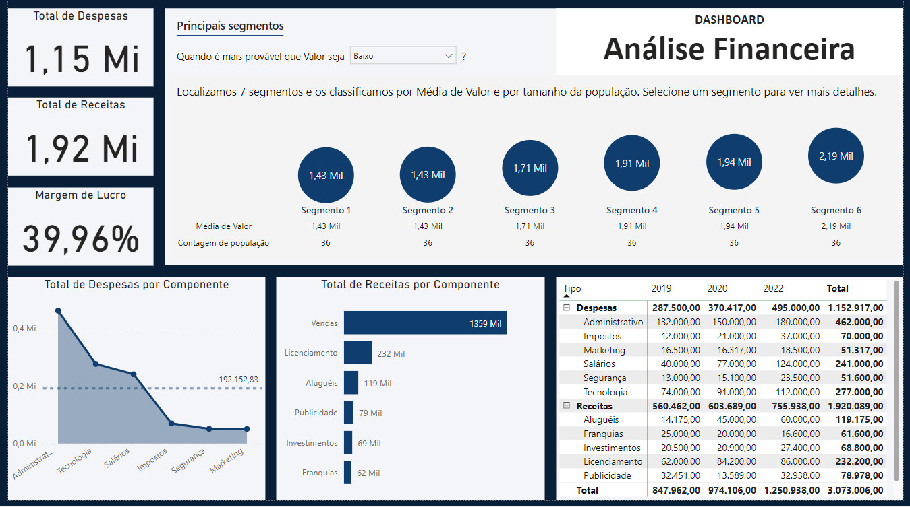

# Dashboard Financeiro
 

  

 

## Sobre o projeto
O objetivo desse dashboard é apresentar uma visão geral de receitas e despesas de uma empresa. Para isso, o painel conta com os seguintes indicadores:

* Total de Receitas
* Total de Despesas
* Margem de Lucro
* Total de Receitas Por Componente
* Total de Despesas Por Componenteem relação à média de Despesas
* Total de Receitase Despesas Por Componente, Por Ano e, com a hierarquia Tipo/Componente.

O dashboard conta ainda com uma visualização para identificar onde as receitas e as despesas são maiores e menores, para facilitar a empresa em suas decisões estratégicas.

* **[Projeto na íntegra (disponível para download)](https://github.com/raffaloffredo/dashboard_financeiro/blob/main/dashboard_financeiro.pbix)**
 

 

## Material Extra
Os dados utilizados nesse projeto referem-se à uma empresa fictícia e também estão disponíveis para download.

* **[Dataset Recursos Humanos](https://github.com/raffaloffredo/dashboard_financeiro/blob/main/dataset_financeiro.xlsx)**
 

## Outros projetos

* **[Dashboard Logístico](https://github.com/raffaloffredo/dashboard_logistica)**
* **[Dashboard de Marketing](https://github.com/raffaloffredo/dashboard_marketing)**
* **[Dashboard de Vendas](https://github.com/raffaloffredo/dashboard_vendas)**
* **[Dashboard de Vendas Globais](https://github.com/raffaloffredo/dashboard_vendas_globais/)**
* **[Airbnb New York](https://github.com/raffaloffredo/airbnb_new_york_portuguese)**
* **[Estudo atualizado sobre COVID-19 no Brasil e no mundo](https://github.com/raffaloffredo/covid_2023_portuguese)**
* **[Detecção de fraude em cartão de crédito](https://github.com/raffaloffredo/fraud_detection_portuguese)**
 

 ## Contatos

  
  
  
  
  

